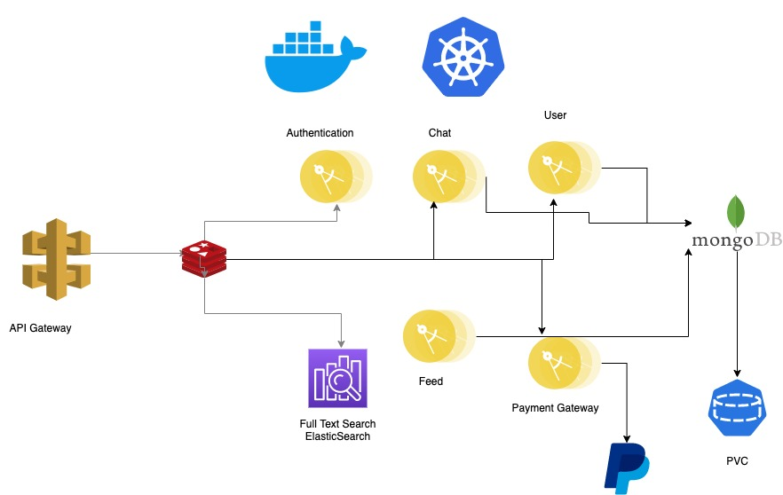

# Microservices
Socially focuses on microservices, infrastructure and containers, created using Nest.js and Typescript. 

It features authentication, ELK stack, Kubernetes deployment, MongoDB database, and Redis as a middleware

**TechStack**

- Nest.js
- TypeScript
- MongoDB
- ElasticSearch
- Redis
- REST APIs
- Docker
- Kubernetes

**CheckList**

- [ ] Auth
- [ ] Feed
- [ ] Chat
- [ ] Payment
- [ ] Full text search
- [ ] Nginx Gateway

**Intial Architecture**

